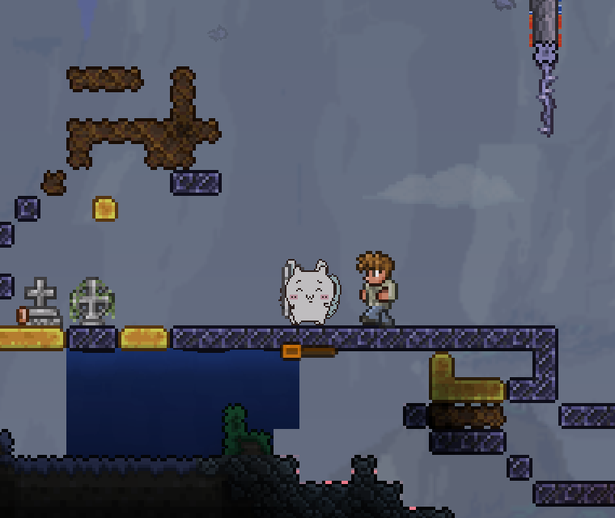
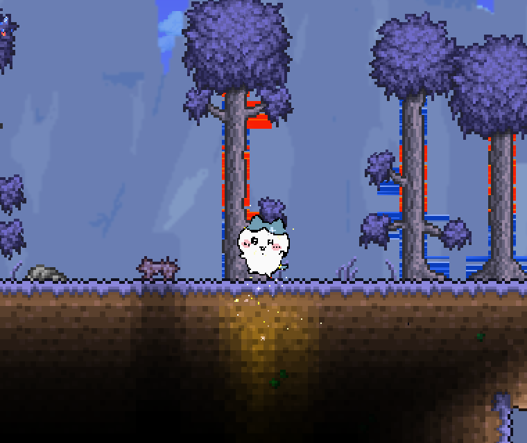
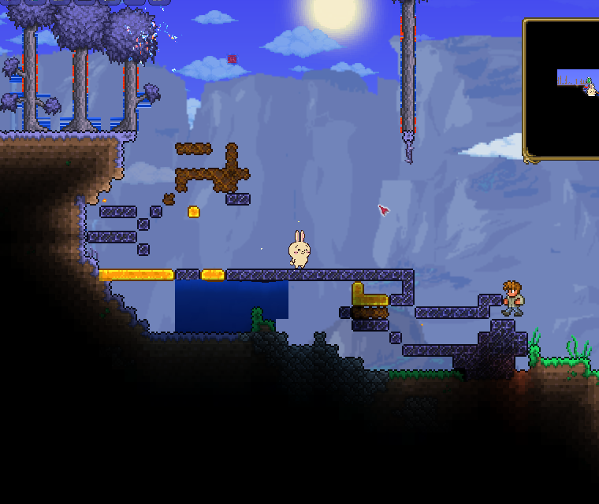
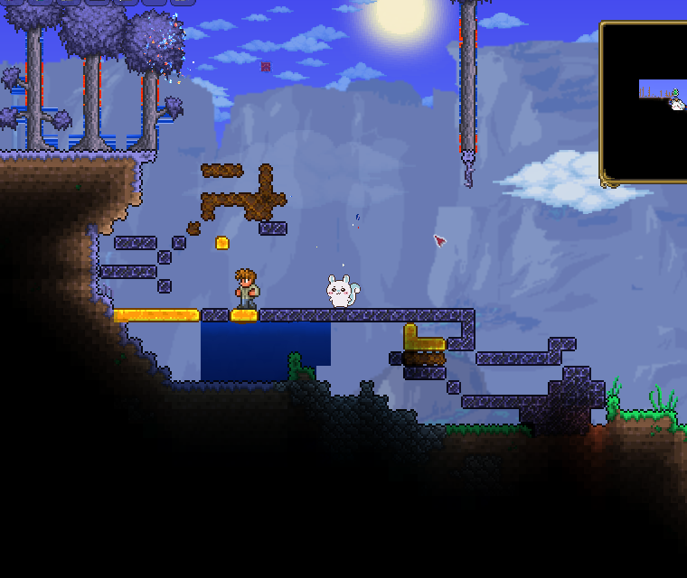
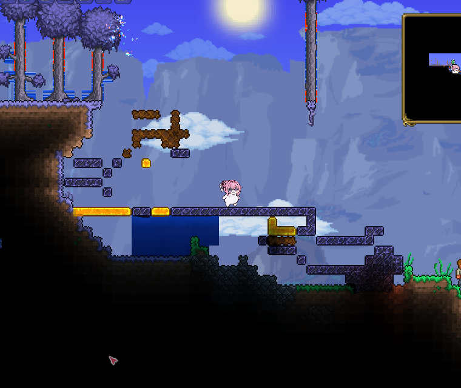
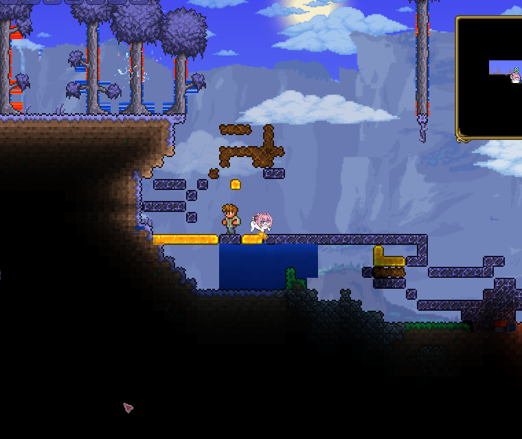

# Riakawa

치이카와·하치와레·우사기·모몽가·도로롱으로 플레이하는 tModLoader 스킨 모드입니다. 플레이어 모습만 바뀌며 무기, 공격, 소리와 게임 진행은 그대로입니다.

작업대에서 나무 4개로 만드는 **세이렌의 섬 주크박스**도 들어 있습니다. 설치하면 이 모드를 위해 새로 만든 곡 "세이렌의 섬"이 흘러나오고, 오른쪽 클릭으로 켜고 끕니다.

## 플레이 화면

  
  

  
  

  
  

## 설치

PC Steam Terraria 1.4.4.9와 tModLoader v2026.08.3.0을 지원합니다.

1. [Steam Workshop의 Riakawa](https://steamcommunity.com/sharedfiles/filedetails/?id=3815015616)를 구독하고 tModLoader의 **Mods**에서 켭니다.
2. **Mod Configuration → Riakawa → 캐릭터**에서 원하는 모습을 고릅니다. **원래 모습**으로 언제든 되돌릴 수 있습니다.

수동 설치는 [출시 파일](https://github.com/westernbear/riakawa/releases/latest)의 `Riakawa.tmod`를 **Mods** 폴더에 넣으면 됩니다. 한국어와 영어 설정을 지원합니다.

비공식·비상업 팬 모드입니다. [크레딧](docs/CREDITS.md) · [개발 안내](docs/DEVELOPMENT.md)
