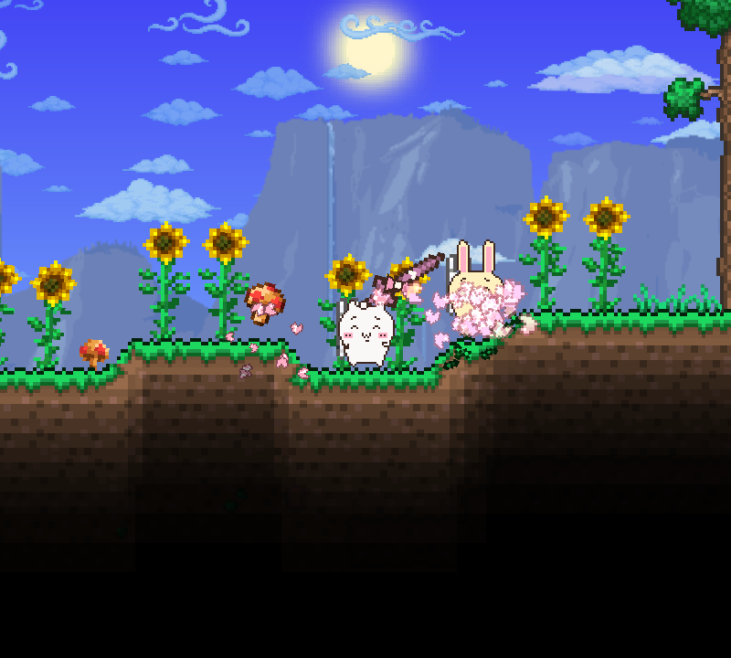
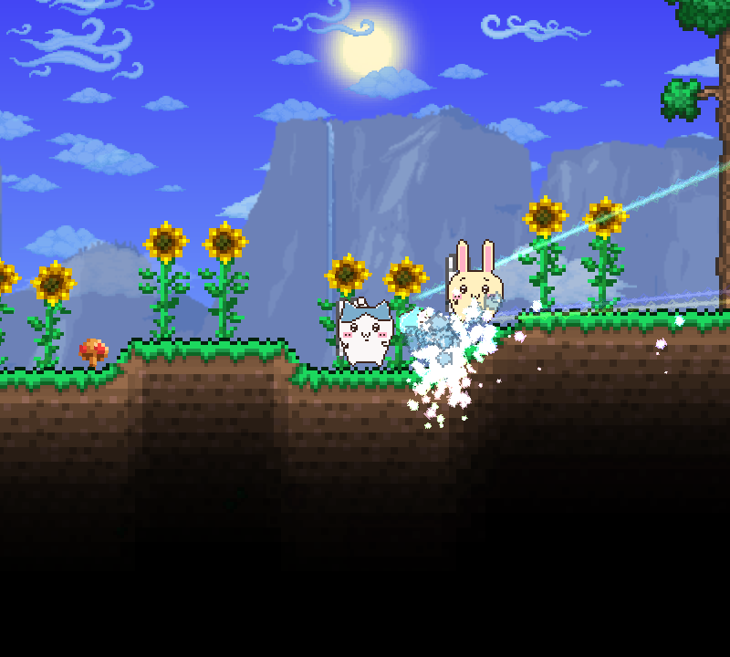
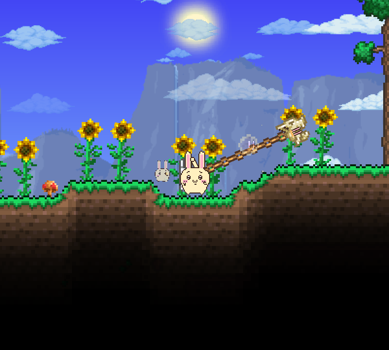
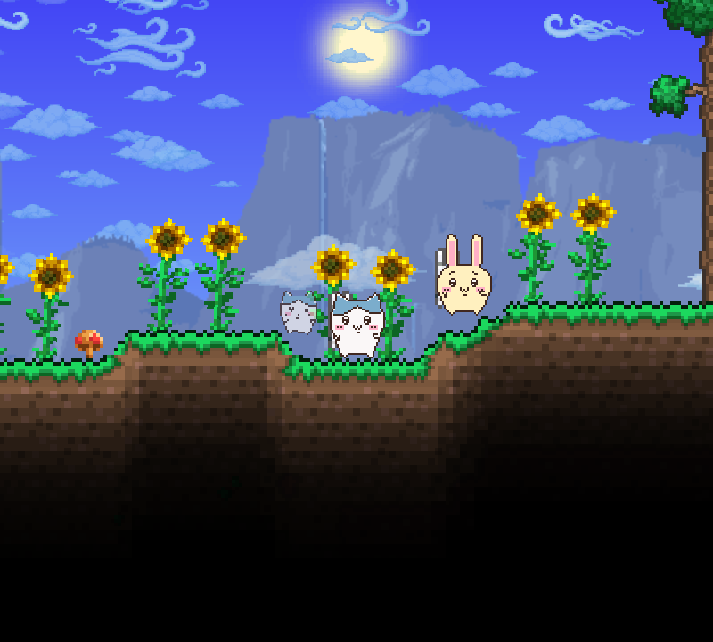
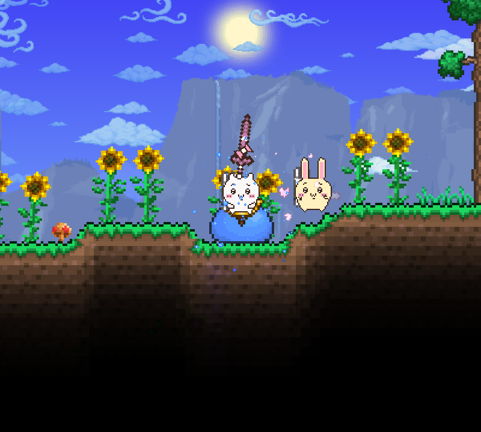
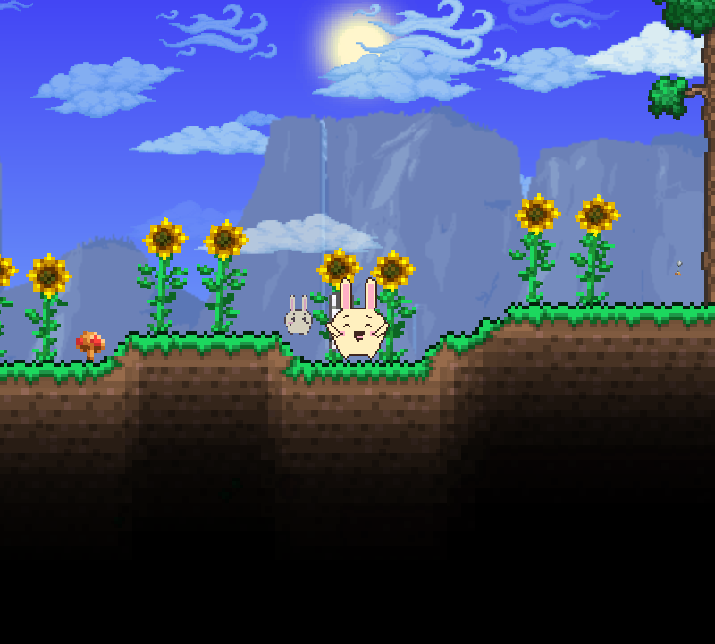
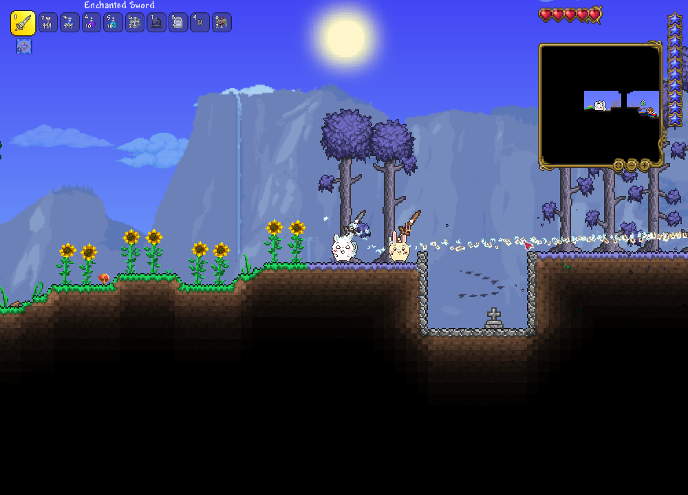
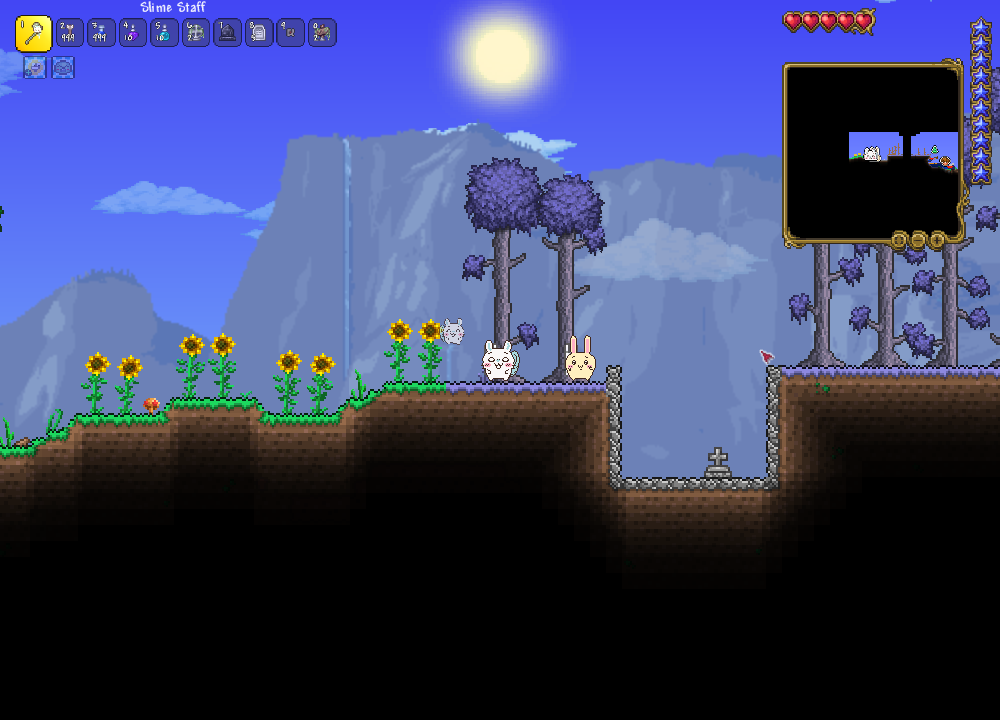

# Riakawa

치이카와·하치와레·우사기·모몽가를 테라리아에 더하는 tModLoader 팬 모드입니다.
캐릭터와 무기 외형, 공격 연출과 소리를 바꾸면서 기존 전투 성능은 유지합니다.

## 플레이 화면

  
  

  
  

  
  

  
  

## 지원 환경

- PC Steam Terraria 1.4.4.9
- tModLoader v2026.08.3.0
- 한국어 · English

## 설치

1. [Riakawa 모드](https://steamcommunity.com/sharedfiles/filedetails/?id=3815015616)를 구독하고 tModLoader의 **Mods**에서 활성화합니다.
2. [Riakawa Music](https://steamcommunity.com/sharedfiles/filedetails/?id=3815008011)을 구독하고 **Workshop → Use Resource Packs**에서 활성화합니다.

수동 설치는 [출시 파일](https://github.com/westernbear/riakawa/releases/latest)을 받으면 됩니다.
`Riakawa.tmod`는 **Mods**, `RiakawaMusic.zip`은 **ResourcePacks** 폴더에 넣고 활성화합니다.

## 사용 방법

- **모드 설정:** 언어·캐릭터 선택, 원래 모습 복원, 무기 외형·음성·효과음 설정
- **V:** 감정표현. 조작 설정에서 키를 바꿀 수 있습니다.
- **음악 볼륨:** 게임의 음악 설정에서 조절

비상업·비공식 팬 프로젝트입니다. [크레딧](docs/CREDITS.md) · [개발](docs/DEVELOPMENT.md) · [검수](docs/RELEASE-REPORT.md)
